### **Document 1/8: Project README**

# **AEM QA System & Workstation**

[](https://github.com)
[](https://github.com)
[](https://github.com)

An integrated solution for translation quality management of AEM (Adobe Experience Manager) content. This system consists of a backend pipeline (`aem-qa-system`) that collects, processes, and indexes data, and a web-based workstation (`aem_qa_station`) where QA specialists can analyze changes between versions and receive AI translation recommendations.

## **✨ Key Features**

### **Backend: Data Pipeline (`aem-qa-system`)**

* **Legacy Asset Integration**: Automatically standardizes and integrates legacy translation memory (TM) and glossary Excel files in various formats.
* **AEM Content Collection**: Collects multilingual content snapshots in parallel for specified AEM page lists and archives them as a single package.
* **PDF-based TM Construction**: Extracts text from multilingual PDF document pairs and automatically generates translation pairs through embedding similarity comparison.
* **Intelligent TM Processing**:
    * **HTML/Text Separation**: Separates components containing HTML tags from TM to refine pure text only.
    * **Semantic Segmentation**: Automatically segments long sentences or complex text to optimal lengths while maintaining semantic consistency.
* **Vector Indexing**: Converts refined TM into vectors using high-performance multilingual embedding models and indexes them in ChromaDB to establish an AI search foundation.

### **Client: QA Workstation (`aem_qa_station`)**

* **Inter-version Change Analysis**: Visually analyzes component addition/modification/deletion history between two AEM versions for page lists uploaded by users.
* **AI Translation Recommendations**: Provides real-time recommendations for the most similar translation cases based on TM indexed in ChromaDB for modified or added text.
* **Dynamic Version Management**: Provides UI for selecting analysis targets by dynamically querying all AEM version information collected in the database.
* **Detailed Analysis and Reporting**: Offers features for filtering and sorting analysis results on the dashboard and downloading complete content as detailed Excel reports.

## **🏗️ Architecture Overview**

This system has a separated structure where the data processing pipeline and user application exchange data through MongoDB and ChromaDB.

```mermaid
graph TD
    subgraph A["External Sources"]
        F1["📄 Excel Files"]
        F2["📝 AEM Page Lists"]
        F3["📑 PDF Documents"]
    end

    subgraph B["Backend: aem-qa-system"]
        P1["Data Collection/Processing Pipeline<br/>(Jupyter Notebooks)"]
        C["Collectors"]
        R["Processors"]
        I["Indexer"]
        P1 --> C
        P1 --> R
        P1 --> I
    end

    subgraph D["Database (Docker)"]
        DB1["MongoDB<br/>(Component, TM Storage)"]
        DB2["ChromaDB<br/>(Vector Index Storage)"]
    end

    subgraph E["Client: aem_qa_station"]
        APP["🔍 Streamlit QA Workstation"]
    end

    A --> B
    B --> D
    E --> D

    style B fill:#e1f5fe,stroke:#333,stroke-width:2px
    style E fill:#e8f5e9,stroke:#333,stroke-width:2px
```



## **🛠️ Technology Stack**

| Category | Technology |
| :------------ | :----------------------------------------------------------------------------------------------------------- |
| **Backend** | Python, Jupyter Notebook, Pandas, PyMuPDF |
| **AI/ML** | Sentence-Transformers, Scikit-learn, Spacy, PyTorch |
| **Database** | MongoDB (pymongo), ChromaDB |
| **Frontend** | Streamlit |
| **DevOps** | Docker, Docker Compose |

## **📂 Directory Structure**

```
.
├── aem-qa-system/                # Backend: Data processing pipeline
│   ├── data/                     # 1_input, 2_downloaded, 3_processed data
│   ├── notebooks/                # Master notebooks for executing stages 1, 2, 3
│   ├── src/                      # Backend core source code (collectors, processors, etc.)
│   ├── docker-compose.yml        # DB service definition
│   └── requirements.txt          # Backend Python dependencies
└── aem_qa_station/               # Client: Streamlit web application
    ├── app.py                    # Streamlit application main file
    ├── modules/                  # Client core logic (analyzer, searcher, etc.)
    └── requirements.txt          # Client Python dependencies
```

## **🚀 Quick Start**

### **1. Prerequisites**

* Git
* Docker & Docker Compose
* Python 3.10 or higher

### **2. Installation and Setup**

```bash
# 1. Clone the project
git clone <repository_url>
cd <repository_name>

# 2. Run backend services (DB)
docker-compose -f aem-qa-system/docker-compose.yml up -d

# 3. Install backend/client dependencies
pip install -r aem-qa-system/requirements.txt
pip install -r aem_qa_station/requirements.txt

# 4. Initialize database collections and indexes
python aem-qa-system/scripts/setup_collections.py
```

### **3. System Execution**

#### **Step 1: Execute Data Pipeline (Backend)**

Execute the master notebooks in the `aem-qa-system/notebooks/` directory **in order** to prepare the data.

1. **`1_Master_Process_Excels.ipynb`**: Processes Excel files in `data/1_input/source_excels` to generate `base_tm.csv` and `glossary.csv`.
2. **`2_Master_Create_Package.ipynb`**: Collects content snapshots based on AEM page lists and generates `aem_content_package.zip`.
   * **⚠️ Warning**: This notebook may encounter a `NameError` due to a bug in `collection_pipeline.py`. You need to modify `manifest_data` to `collection_results` on line 83 of the `aem-qa-system/src/collectors/collection_pipeline.py` file.
3. **`3_Master_Ingest_Data.ipynb`**: Loads the generated package and CSV into MongoDB, builds the final TM, and indexes it in ChromaDB.
   * **⚠️ Warning**: This notebook may encounter a `ModuleNotFoundError` due to path configuration issues. Check that the `PROJECT_ROOT` path at the top of the notebook is correct and you may need to restart the kernel.

#### **Step 2: Execute QA Workstation (Client)**

Once data preparation is complete, run the Streamlit application.

```bash
streamlit run aem_qa_station/app.py
```

You can then start working through the `AEM Translation QA Workstation` screen that appears in your web browser.