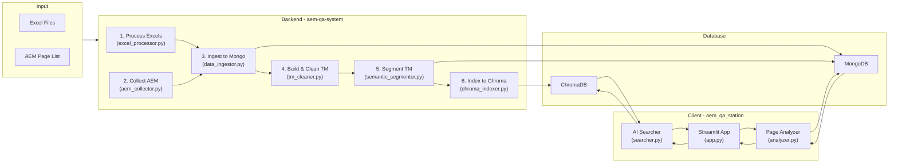

### **Document 2/8: Integrated Architecture Guide**

## **🏛️ AEM QA System & Workstation: Integrated Architecture Guide**

This document describes the overall technical architecture, components, data flow, and design principles of the AEM QA System & Workstation. It serves as the top-level technical design document for developers who want to maintain or extend the system.

-----

## 1. Architecture Overview

This system adopts a **Decoupled Architecture**.

* **Backend System (`aem-qa-system`)**: A data pipeline responsible for data collection, transformation, loading (ETL), and indexing. It is designed to run as periodic batch jobs.
* **Client Application (`aem_qa_station`)**: A real-time web-based workstation used by QA specialists. It queries and analyzes data prepared by the backend to provide value to users.

The two systems do not communicate directly but exchange data **asynchronously** through the **persistence layer** consisting of **MongoDB** and **ChromaDB**. This structure ensures that backend data processing operations do not affect the availability of the client application, enhancing system stability and scalability.

-----

## 2. System Components

The system consists of three major logical layers.

#### **2.1. Backend System (`aem-qa-system`)**

Responsible for collecting and processing AEM content and translation assets, then storing them in the database.

* **Orchestrator (Jupyter Notebooks)**
    * The three master notebooks in the `notebooks/` directory act as conductors controlling the execution order of the entire backend pipeline.
* **Collectors**
    * `excel_processor.py`: Converts Excel files (TM, Glossary) in various formats to standardized CSV.
    * `aem_collector.py`: Connects to AEM servers to collect multilingual JSON snapshots of specified pages in parallel.
    * `pdf_collector.py`: Downloads original PDF documents based on PDF file lists.
* **Processors**
    * `data_ingestor.py`: Stores collected AEM snapshot packages in the `page_components` collection of MongoDB.
    * `aem_tm_builder.py`: Builds initial translation memory (TM) by comparing inter-version structures based on `page_components` data.
    * `tm_cleaner.py` & `ultimate_tm_builder.py`: Remove noise such as HTML tags from initial TM and separate pure text from HTML components.
    * `semantic_segmenter.py`: Automatically segments long sentences in refined text into semantically consistent short segments using AI embedding models.
* **Indexer**
    * `chroma_indexer.py`: Converts text from the final refined/segmented TM into vector embeddings and stores them in ChromaDB, preparing for AI similarity search.

#### **2.2. Client Application (`aem_qa_station`)**

An interactive web application built with Streamlit that provides an intuitive UI for QA specialists.

* **Main Application (`app.py`)**
    * Uses Streamlit to compose the overall UI layout, handle user interactions, and call other modules to execute business logic.
* **Core Modules (`modules/`)**
    * `analyzer.py`: Directly queries the `page_components` collection in MongoDB for two versions selected by the user to analyze component-level changes (additions/modifications/deletions) in real-time.
    * `searcher.py`: Queries ChromaDB based on analyzed text changes to search for similar translation cases and generate 'AI translation recommendation' results.
    * `version_manager.py`: Scans MongoDB to dynamically generate a list of all analyzable AEM versions and provides them as UI options.
    * `connections.py`: Efficiently manages and reuses connections to MongoDB and ChromaDB using Streamlit's caching functionality.

#### **2.3. Persistence Layer**

Serves as the data hub between backend and client, managed through Docker Compose.

* **MongoDB**:
    * **Role**: Primary storage for structured data.
    * **Key Collections**: `page_components` (AEM component originals), `clean_translation_memory_*` (final refined TM), `html_component_archive_*` (HTML components), etc.
* **ChromaDB**:
    * **Role**: Storage and retrieval of text embedding vectors.
    * **Key Collections**: Vector index collections created by language pairs such as `tm_en_ko`, `tm_en_ja`, etc.

-----

## 3. Data Flow Diagram (End-to-End Data Flow)

The diagram below shows the complete data flow from initial user data input to final QA analysis results.

-----

## 4. Architecture Design Principles

* **Modularity**: The system is composed of functionally distinct modules such as `collectors`, `processors`, and `analyzers`, making it easy to modify or add specific functions.
* **Scalability**: The data collector (`aem_collector`) performs parallel processing using multiple workers, and collection performance can be scaled by increasing the number of workers when needed. Additionally, since the Streamlit application uses standard web technologies, it can be scaled horizontally by deploying multiple instances behind a load balancer.
* **Reusability**: Common functions such as database connections (`connections.py`) and version queries (`version_manager.py`) are separated into independent modules and reused across multiple components. This helps reduce code duplication and maintain consistency.