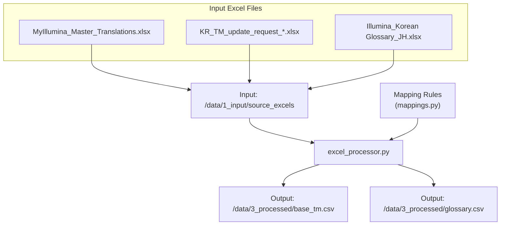
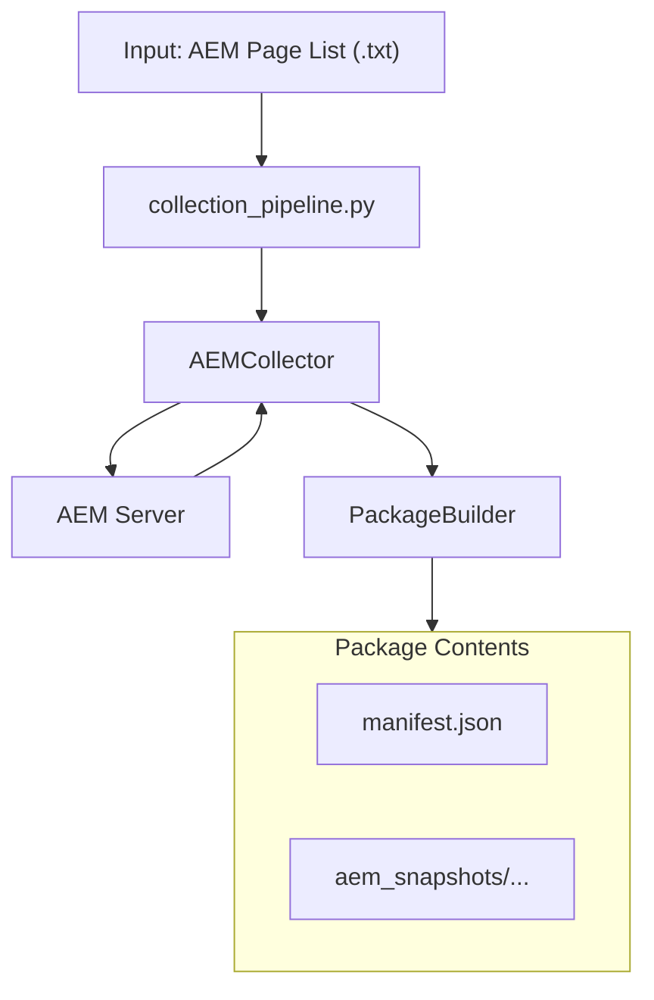
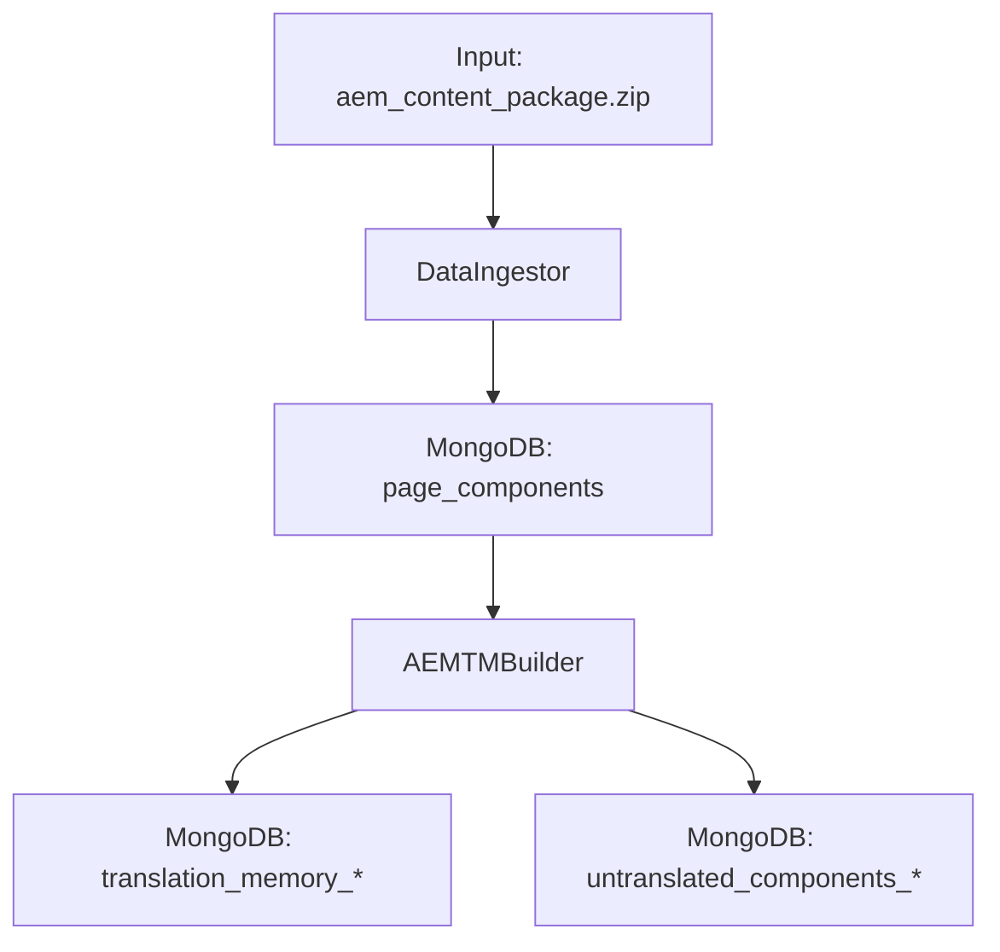
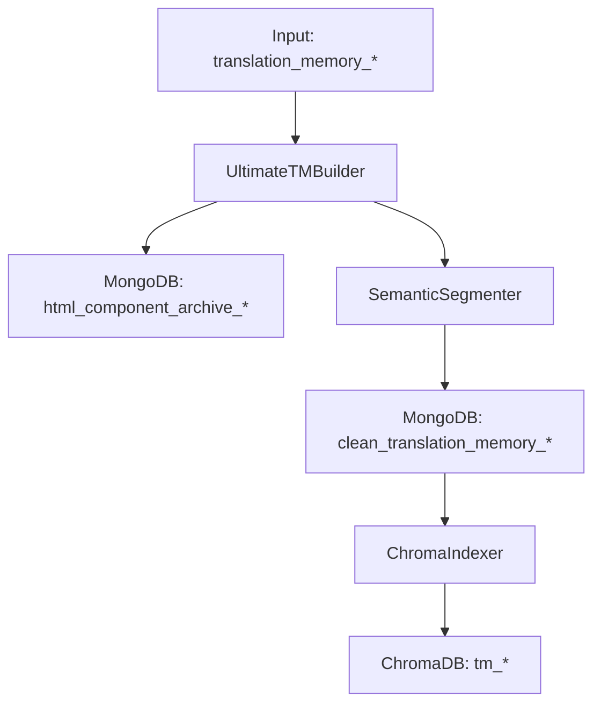

### **Document 4/8: Backend Pipeline Workflow**

## **⚙️ Backend Pipeline Workflow Guide (`aem-qa-system`)**

This document provides a detailed description of the core data processing pipeline in the `aem-qa-system` backend. The entire pipeline consists of four major workflows that are executed sequentially by Jupyter Notebooks. Each workflow serves a specific purpose and uses the output from the previous stage as input.

-----

## Workflow 1: Legacy Asset Standardization (Excel → Standard CSV)

* **Goal**: Integrate existing translation assets (TM, glossaries) scattered in various formats into a single standard format that the system can recognize.
* **Executor**: `notebooks/1_Master_Process_Excels.ipynb`
* **Core Modules**: `src/utils/excel_processor.py`, `src/utils/mappings.py`

#### **Process Flow**

1. **Input**: `1_Master_Process_Excels.ipynb` scans all `.xlsx` files located in the `tm` and `glossary` folders under `data/1_input/source_excels`.
2. **Rule-based Transformation**: `excel_processor.py` opens each file and analyzes the column structure.
   * It references rule dictionaries defined in `mappings.py` such as `FOUNDATION_TM_MAP`, `UPDATE_REQUEST_TM_MAP`, `UI_TEXT_MAP`, etc., to map various source/translation column names like 'English', 'en-US', 'Target (from EN)' to standard field names `source_text` and `target_text`.
   * For glossary processing specifically, it iterates through all sheets within the file to extract and integrate data comprehensively.
3. **Cleaning and Integration**: After combining all collected data, it removes duplicate `source_text` entries and deletes empty rows to clean the data.
4. **Output**: The standardized translation memory is finally saved as `data/3_processed/base_tm.csv`, and the glossary as `glossary.csv`. These files are used in subsequent workflows.

-----

## Workflow 2: AEM Content Collection and Packaging

* **Goal**: Collect the latest multilingual version content of target AEM pages for analysis and archive them as a single package file for stable data processing.
* **Executor**: `notebooks/2_Master_Create_Package.ipynb`
* **Core Modules**: `src/collectors/aem_collector.py`, `src/collectors/package_builder.py`, `src/collectors/collection_pipeline.py`

#### **Process Flow**

1. **Input**: `2_Master_Create_Package.ipynb` presents a file selection dialog to the user to input a `.txt` file containing AEM page paths.
2. **Parallel Collection**: `AEMCollector` generates `.model.json` URLs for all defined versions (`sot-en`, `lm-ko`, etc.) for each input page path. It then uses `ThreadPoolExecutor` to send HTTP requests to multiple URLs simultaneously through multiple workers to download content snapshots in parallel.
3. **File Information Generation**: When each snapshot is successfully downloaded, a `FileInfo` data object containing metadata such as file path, size, page path, and version name is created.
4. **Packaging**: `PackageBuilder` receives all collected files and the `FileInfo` object list.
   * It adds all snapshot files to a ZIP archive.
   * Based on the `FileInfo` list, it creates a `manifest.json` file containing the complete file list and metadata and stores it together in the ZIP archive.
5. **Output**: An `aem_content_package_TIMESTAMP.zip` file containing all AEM snapshots and metadata is created. This package ensures data integrity and is passed to the next stage.

-----

## Workflow 3: Data Loading and Initial TM Construction

* **Goal**: Store the collected AEM data package in MongoDB and generate initial translation memory (TM) that requires translation through inter-version comparison.
* **Executor**: `notebooks/3_Master_Ingest_Data.ipynb`
* **Core Modules**: `src/processors/data_ingestor.py`, `src/processors/aem_tm_builder.py`

#### **Process Flow**

1. **Data Ingestion**: `DataIngestor` reads `aem_content_package.zip` and parses `manifest.json`. It iterates through each AEM snapshot JSON file and performs the following:
   * Calculates a hash (`snapshot_hash`) for the entire page content.
   * Compares with the hash of the latest version stored in the DB, and only assigns a new version number and stores it if changes are detected (incremental update).
   * Decomposes the page into individual component units and calculates a hash (`component_hash`) for each component's content, storing them in the `page_components` collection.

2. **TM Construction**: `AEMTMBuilder` queries data from the `page_components` collection for user-specified source version (e.g., `lm-en`) and target version (e.g., `spac-ko_KR`) by page.
   * **Structure Comparison**: For each page, it checks whether the component paths (`component_path`) and order (`component_order`) of the two versions match completely.
   * **Translation Pair Extraction**: Only when structures match, it pairs components with the same `component_path` to extract `source_text` and `target_text` and stores them in the `translation_memory_*` collection.
   * **Mismatch Handling**: Components from pages with different structures cannot form translation pairs, so they are stored separately in the `untranslated_components_*` collection for future analysis.

-----

## Workflow 4: TM Cleaning, Segmentation, and Indexing

* **Goal**: Process the initial TM into high-quality AI training and search data. Remove HTML noise, segment long text into semantic units, and index them in a vector database.
* **Executor**: `notebooks/3_Master_Ingest_Data.ipynb` (latter half)
* **Core Modules**: `src/processors/ultimate_tm_builder.py`, `src/processors/semantic_segmenter.py`, `src/indexing/chroma_indexer.py`

#### **Process Flow**

1. **HTML/Text Separation**: `UltimateTMBuilder` reads each record from the `translation_memory_*` collection and checks whether `source_text` and `target_text` contain HTML tags.
   * Records containing HTML are moved to the `html_component_archive_*` collection along with original metadata.
   * Only pure text records without HTML are passed to the next stage.

2. **Semantic Segmentation**: `SemanticSegmenter` processes pure text records that are long or composed of multiple sentences.
   * Uses spaCy to separate text into sentence units.
   * Uses Sentence-Transformer models to calculate vector embeddings representing the meaning of each sentence.
   * Based on dynamic programming and semantic similarity scores, segments the original text into semantically consistent segments of appropriate length (e.g., around 70 characters).
   * The segmented segments inherit original metadata and are stored in the `clean_translation_memory_*` collection.

3. **Vector Indexing**: `ChromaIndexer` reads all records from the final output `clean_translation_memory_*` collection.
   * Converts each record's `source_text` into vector embeddings using Sentence-Transformer models.
   * Stores the generated vectors along with metadata such as `target_text` and `page_path` in the corresponding language pair collection in ChromaDB (e.g., `tm_en_ko`).

4. **Output**: Upon completion of this workflow, both high-quality refined TM and vector indexes are prepared for use by the QA workstation (`aem_qa_station`) for AI translation recommendations.