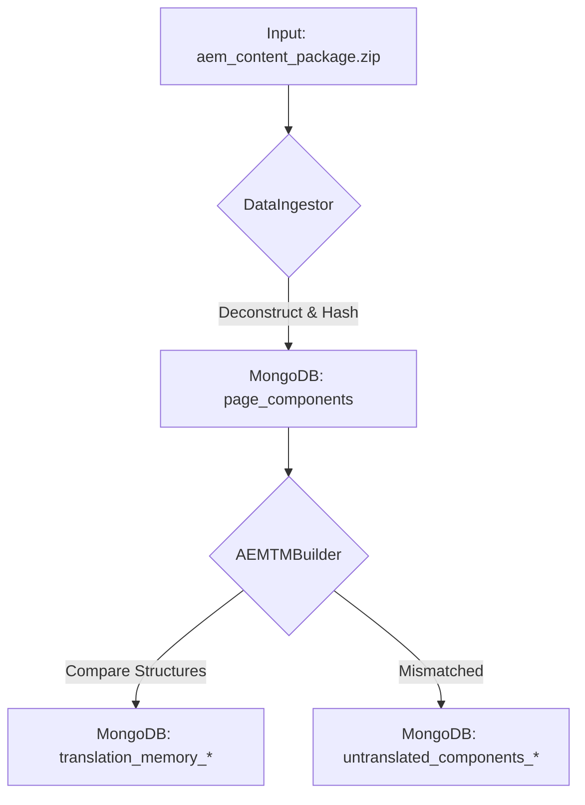
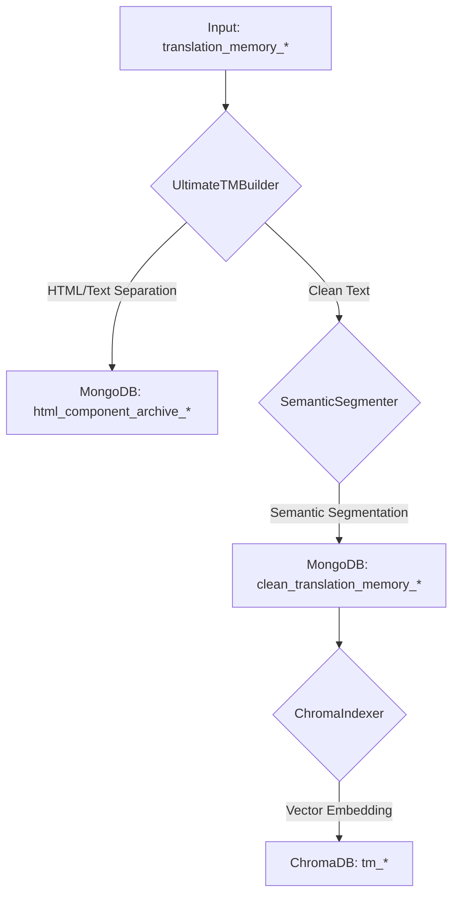

### **문서 4/8: 백엔드 파이프라인 워크플로우**

## **⚙️ 백엔드 파이프라인 워크플로우 가이드 (`aem-qa-system`)**

이 문서는 `aem-qa-system` 백엔드의 핵심 데이터 처리 파이프라인을 상세히 설명합니다. 전체 파이프라인은 Jupyter Notebooks에 의해 순차적으로 실행되는 4개의 주요 워크플로우로 구성됩니다. 각 워크플로우는 특정 목적을 가지며, 이전 단계의 산출물을 입력으로 사용합니다.

-----

### \#\# 워크플로우 1: 레거시 자산 표준화 (Excel → 표준 CSV)

  * **목표**: 다양한 형식으로 흩어져 있는 기존 번역 자산(TM, 용어집)을 시스템이 인식할 수 있는 단일 표준 포맷으로 통합합니다.
  * **실행 주체**: `notebooks/1_Master_Process_Excels.ipynb` [cite: 1\_Master\_Process\_Excels.ipynb]
  * **핵심 모듈**: `src/utils/excel_processor.py`, `src/utils/mappings.py`

#### **프로세스 흐름**

```mermaid
graph TD
    A[Input: /data/1_input/source_excels] --> B{excel_processor.py};
    C[Mapping Rules<br/>(mappings.py)] --> B;
    B -- TM Processing --> D[Output: /data/3_processed/base_tm.csv];
    B -- Glossary Processing --> E[Output: /data/3_processed/glossary.csv];

    subgraph "입력 엑셀 파일"
        direction LR
        A1["MyIllumina_Master_Translations.xlsx"]
        A2["KR_TM_update_request_*.xlsx"]
        A3["Illumina_Korean Glossary_JH.xlsx"]
    end
    
    A1 & A2 & A3 --> A;
```

1.  **입력**: `1_Master_Process_Excels.ipynb`는 `data/1_input/source_excels` 하위의 `tm`과 `glossary` 폴더에 위치한 모든 `.xlsx` 파일을 스캔합니다.
2.  **규칙 기반 변환**: `excel_processor.py`는 각 파일을 열어 컬럼 구조를 분석합니다 [cite: excel\_processor.py].
      * `mappings.py`에 정의된 `FOUNDATION_TM_MAP`, `UPDATE_REQUEST_TM_MAP`, `UI_TEXT_MAP` 등의 규칙 사전을 참조하여, 'English', 'en-US', 'Target (from EN)'과 같이 제각기 다른 원문/번역문 컬럼명을 `source_text`, `target_text`라는 표준 필드명으로 매핑합니다 [cite: mappings.py].
      * 특히 용어집 처리 시, 파일 내의 모든 시트(sheet)를 순회하며 데이터를 추출하여 통합 처리합니다.
3.  **정제 및 통합**: 수집된 모든 데이터를 하나로 합친 후, 중복된 `source_text`를 제거하고 빈 행을 삭제하여 데이터를 정제합니다.
4.  **출력**: 최종적으로 표준화된 번역 메모리는 `data/3_processed/base_tm.csv`로, 용어집은 `glossary.csv`로 저장됩니다. 이 파일들은 후속 워크플로우에서 사용됩니다.

-----

### \#\# 워크플로우 2: AEM 콘텐츠 수집 및 패키징

  * **목표**: 분석 대상 AEM 페이지들의 다국어 버전 콘텐츠를 최신 상태로 수집하고, 안정적인 데이터 처리를 위해 단일 패키지 파일로 아카이빙합니다.
  * **실행 주체**: `notebooks/2_Master_Create_Package.ipynb` [cite: 2\_Master\_Create\_Package.ipynb]
  * **핵심 모듈**: `src/collectors/aem_collector.py`, `src/collectors/package_builder.py`, `src/collectors/collection_pipeline.py`

#### **프로세스 흐름**

```mermaid
graph TD
    A[Input: AEM Page List (.txt)] --> B[collection_pipeline.py];
    B -- Page Paths --> C{AEMCollector};
    C -- HTTP Requests --> D[AEM Server];
    D -- JSON Snapshots --> C;
    C -- FileInfo List --> E{PackageBuilder};
    E --> F[Output: aem_content_package_TIMESTAMP.zip];
    
    subgraph F
        direction LR
        F1[manifest.json]
        F2[aem_snapshots/...]
    end
```

1.  **입력**: `2_Master_Create_Package.ipynb`는 사용자에게 파일 선택창을 띄워 AEM 페이지 경로가 나열된 `.txt` 파일을 입력받습니다 [cite: collection\_pipeline.py].
2.  **병렬 수집**: `AEMCollector`는 입력된 각 페이지 경로에 대해 정의된 모든 버전(`sot-en`, `lm-ko` 등)의 `.model.json` URL을 생성합니다. 이후 `ThreadPoolExecutor`를 사용하여 다수의 워커(worker)를 통해 여러 URL에 동시에 HTTP 요청을 보내 콘텐츠 스냅샷을 병렬로 다운로드합니다 [cite: aem\_collector.py].
3.  **파일 정보 생성**: 각 스냅샷이 성공적으로 다운로드되면, 파일 경로, 크기, 페이지 경로, 버전명 등의 메타데이터를 담은 `FileInfo` 데이터 객체가 생성됩니다 [cite: data\_models.py].
4.  **패키징**: `PackageBuilder`는 수집된 모든 파일과 `FileInfo` 객체 리스트를 전달받습니다.
      * 모든 스냅샷 파일을 ZIP 아카이브에 추가합니다.
      * `FileInfo` 리스트를 기반으로 전체 파일 목록과 메타데이터를 담은 `manifest.json` 파일을 생성하여 ZIP 아카이브에 함께 저장합니다 [cite: package\_builder.py].
5.  **출력**: 모든 AEM 스냅샷과 메타데이터가 포함된 `aem_content_package_TIMESTAMP.zip` 파일이 생성됩니다. 이 패키지는 데이터의 무결성을 보장하며 다음 단계로 전달됩니다.

-----

### \#\# 워크플로우 3: 데이터 적재 및 초기 TM 구축

  * **목표**: 수집된 AEM 데이터 패키지를 MongoDB에 저장하고, 버전 간 비교를 통해 번역이 필요한 초기 번역 메모리(TM)를 생성합니다.
  * **실행 주체**: `notebooks/3_Master_Ingest_Data.ipynb` [cite: 3\_Master\_Ingest\_Data.ipynb]
  * **핵심 모듈**: `src/processors/data_ingestor.py`, `src/processors/aem_tm_builder.py`

#### **프로세스 흐름**



1.  **데이터 적재(Ingest)**: `DataIngestor`는 `aem_content_package.zip`을 읽어 `manifest.json`을 파싱합니다. 각 AEM 스냅샷 JSON 파일을 순회하며 다음을 수행합니다 [cite: data\_ingestor.py]:
      * 페이지 전체 콘텐츠에 대한 해시(`snapshot_hash`)를 계산합니다.
      * DB에 저장된 가장 최신 버전의 해시와 비교하여, 변경된 경우에만 새로운 버전 번호를 부여하여 저장합니다 (증분 업데이트).
      * 페이지를 개별 컴포넌트 단위로 분해하고, 각 컴포넌트의 내용에 대한 해시(`component_hash`)를 계산하여 `page_components` 컬렉션에 저장합니다.
2.  **TM 구축**: `AEMTMBuilder`는 `page_components` 컬렉션에서 사용자가 지정한 소스 버전(예: `lm-en`)과 타겟 버전(예: `spac-ko_KR`)의 데이터를 페이지별로 조회합니다 [cite: aem\_tm\_builder.py].
      * **구조 비교**: 각 페이지에 대해 두 버전의 컴포넌트 경로(`component_path`)와 순서(`component_order`)가 완전히 일치하는지 검사합니다.
      * **번역 쌍 추출**: 구조가 일치하는 경우에만, 동일한 `component_path`를 가진 컴포넌트들을 짝지어 `source_text`와 `target_text`를 추출하고 `translation_memory_*` 컬렉션에 저장합니다.
      * **불일치 처리**: 구조가 다른 페이지의 컴포넌트들은 번역 쌍을 만들 수 없으므로, `untranslated_components_*` 컬렉션에 별도로 저장하여 추후 분석에 사용합니다.

-----

### \#\# 워크플로우 4: TM 정제, 분할 및 인덱싱

  * **목표**: 초기 TM을 고품질의 AI 학습 및 검색 데이터로 가공합니다. HTML 노이즈를 제거하고, 긴 텍스트를 의미 단위로 분할한 뒤, 벡터 데이터베이스에 인덱싱합니다.
  * **실행 주체**: `notebooks/3_Master_Ingest_Data.ipynb` (후반부)
  * **핵심 모듈**: `src/processors/utlimate_tm_builder.py`, `src/processors/semantic_segmenter.py`, `src/indexing/chroma_indexer.py`

#### **프로세스 흐름**



1.  **HTML/텍스트 분리**: `UltimateTMBuilder`는 `translation_memory_*` 컬렉션의 각 레코드를 읽어 `source_text`와 `target_text`에 HTML 태그가 포함되어 있는지 검사합니다 [cite: utlimate\_tm\_builder.py].
      * HTML이 포함된 레코드는 원본 메타데이터와 함께 `html_component_archive_*` 컬렉션으로 이동됩니다.
      * HTML이 없는 순수 텍스트 레코드만 다음 단계로 전달됩니다.
2.  **의미 기반 분할**: `SemanticSegmenter`는 순수 텍스트 레코드 중 길이가 길거나 여러 문장으로 구성된 텍스트를 처리합니다 [cite: semantic\_segmenter.py].
      * spaCy를 이용해 텍스트를 문장 단위로 분리합니다.
      * Sentence-Transformer 모델을 사용해 각 문장의 의미를 나타내는 벡터 임베딩을 계산합니다.
      * 동적 프로그래밍과 의미적 유사도 점수를 기반으로, 원본 텍스트를 의미적으로 가장 일관되면서도 적절한 길이(예: 70자 내외)의 세그먼트로 분할합니다.
      * 분할된 세그먼트들은 원본 메타데이터를 상속받아 `clean_translation_memory_*` 컬렉션에 저장됩니다.
3.  **벡터 인덱싱**: `ChromaIndexer`는 최종 산출물인 `clean_translation_memory_*` 컬렉션의 모든 레코드를 읽습니다 [cite: chroma\_indexer.py].
      * 각 레코드의 `source_text`를 Sentence-Transformer 모델을 사용해 벡터 임베딩으로 변환합니다.
      * 생성된 벡터를 `target_text`, `page_path` 등의 메타데이터와 함께 ChromaDB의 해당 언어 쌍 컬렉션(예: `tm_en_ko`)에 저장합니다.
4.  **출력**: 이 워크플로우가 완료되면, QA 워크스테이션(`aem_qa_station`)이 AI 번역 추천을 위해 사용할 수 있는 고품질의 정제된 TM과 벡터 인덱스가 모두 준비됩니다.