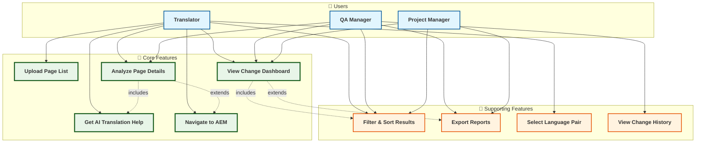

# AEM QA Station - Use Cases & User Guide

## 📊 Use Case Diagram



---

## 📝 System Overview

**AEM QA Station** is an AI-powered workstation that automates translation quality assurance for AEM (Adobe Experience Manager) multilingual websites. It automatically detects webpage changes and provides optimal translation recommendations through AI trained on existing translation data, maximizing productivity for translators and QA professionals.

---

## 👥 Key Features by User Role

### 🔤 **Translator**
- **Daily Task Automation**: Automatic identification and prioritization of changed pages
- **AI Translation Support**: Smart recommendations based on similar existing translation cases
- **One-Click Editing**: Direct navigation to AEM edit pages for immediate work

### 📊 **QA Manager**  
- **Team Performance Monitoring**: Real-time tracking of translation progress and quality metrics
- **Issue Page Identification**: Instant detection of structural changes or missing translations
- **Quality Reports**: Detailed analysis report generation and team feedback

### 📈 **Project Manager**
- **Project Progress Tracking**: Overview of overall translation project progress and bottlenecks
- **Resource Planning**: Efficient workforce allocation through workload prediction
- **Performance Reporting**: Executive summary reports for management

---

## 🎯 Detailed Feature Descriptions

### 1. 📤 **Upload Page List**
**Function**: Upload a list of web pages to review via CSV file

**Usage Scenario**:
- Marketing team requests: "Please review translation for 20 updated product pages this week"
- Drag & drop CSV file upload with automatic page path recognition
- System automatically detects and processes different column names and formats

**Expected Benefits**: 
- **90% reduction** in time spent manually searching for pages
- Prevention of human errors from missing pages

---

### 2. 📊 **Change Dashboard**
**Function**: Comprehensive dashboard for overview of changes across uploaded pages

**Information Provided**:
- **Per-page Change Statistics**: Count of added/modified/deleted components
- **Priority Display**: Color-coded urgent translation pages
- **Workload Estimation**: Estimated work time per page
- **Filtering Options**: Filter by status, change type, and language

**Real Usage Example**:
```
📄 /products/new-sequencer
🟡 QA Required (5 items) | 📊 15 total | ➕ 3 added | ✏️ 2 modified
📈 Change Rate: 33.3% | ⏱️ Est. 2 hours

📄 /company/about-us  
🟢 No Changes | 📊 8 total | 🔄 All unchanged
📈 Change Rate: 0% | ⏱️ Est. 0 minutes
```

---

### 3. 🔍 **Page Detail Analysis**
**Function**: Detailed component-level analysis of changes for specific pages

**Analysis Content**:
- **Before/After Comparison**: Visual comparison of structural differences between source and translation
- **Component-wise Changes**: Change history for each element (titles, body text, buttons, images, etc.)
- **Translation Requirements**: Separate display of text-containing changes only
- **AEM Edit Links**: Direct editing links for specific components

**Real Screen Example**:
```
🆕 Newly Added Text:
"Our latest AI-powered genomic sequencer delivers unprecedented accuracy..."

🤖 AI Recommended Translation:
"당사의 최신 AI 기반 유전체 시퀀서는 전례 없는 정확도를 제공합니다..."
(Similarity: 87% | Confidence: High)

📍 Similar Existing Translations:
"AI-powered analysis" → "AI 기반 분석" (used in product pages)
```

---

### 4. 🤖 **AI Translation Recommendations**
**Function**: AI trained on existing translation data provides optimal translation recommendations for new text

**AI Technology**:
- **Semantic Similarity Search**: Finds similar translation cases by understanding context and meaning, not just keywords
- **Confidence Scoring**: Displays recommendation confidence as percentage
- **Context Information**: Provides information about pages and situations where similar translations were used

**Real Recommendation Example**:
```
Source: "Experience breakthrough performance"

🤖 AI Recommendation (Confidence: 92%):
"혁신적인 성능을 경험하세요"

📚 Reference Translations:
1. "breakthrough technology" → "혁신적인 기술" (Product intro page)
2. "performance optimization" → "성능 최적화" (Technical documentation)
3. "experience the difference" → "차이를 경험하세요" (Marketing page)
```

---

### 5. 🔗 **Navigate to AEM Pages**
**Function**: Direct navigation from analysis results to AEM edit pages for actual translation work

**Convenience Features**:
- **One-Click Navigation**: Single button to navigate to AEM edit screen for the page
- **Multi-version Support**: Access to both source (English) and target (Korean/Japanese) pages
- **Direct Component Links**: Navigate directly to specific components for targeted editing

**Usage Scenario**:
1. Review changes in QA Station
2. Review AI translation recommendations
3. Click "Edit in AEM" button
4. AEM page opens in new tab → Start editing immediately

---

## 🔧 Supporting Features

### **Filtering & Sorting**
- Status filters: "QA Required", "Has Changes", "No Changes"
- Workload sorting: High workload → Low workload
- Language filters: Separate Korean and Japanese translations

### **Report Export**  
- Download analysis results in CSV format
- Generate summary reports for team meetings
- Automatic project progress reports

### **Language Pair Selection**
- English → Korean translation
- English → Japanese translation  
- Future expansion planned for Chinese, German, etc.

---

## 💡 Real-World Application Scenarios

### **Scenario 1: Regular Website Updates**
> **Situation**: Every Tuesday, marketing team updates 20 product pages  
> **Traditional Method**: Translator manually opens each page to check changes (2-3 hours)  
> **QA Station Approach**: CSV upload → Identify all changes in 5 minutes → AI recommendations reduce translation time by 50%

### **Scenario 2: Urgent Product Launch**
> **Situation**: New product announcement requires 30 pages translated within 24 hours  
> **QA Station Approach**: Automatic priority sorting → Team workload distribution → Real-time progress monitoring → Complete within deadline

### **Scenario 3: Translation Consistency Management**
> **Situation**: Same product names translated differently across pages  
> **QA Station Approach**: AI learns existing translation patterns → Recommends consistent terminology → Ensures brand unity

---

## 🎯 Expected Benefits

### **Work Efficiency**
- ⏱️ **70% Time Reduction**: Automated change identification
- 🎯 **95% Accuracy Improvement**: Consistent translation quality through AI recommendations
- 📊 **Real-time Progress Management**: Early detection of project delay risks

### **User Satisfaction**
- 🔤 **Translators**: Reduced repetitive tasks, focus on creative translation
- 📊 **QA Managers**: Data-driven decision making, visible team performance  
- 📈 **Project Managers**: Accurate schedule prediction, resource optimization

### **Business Impact**
- 💰 **Cost Reduction**: 30% savings in translation outsourcing costs
- 🚀 **Launch Speed**: 50% faster multilingual product launches
- 🌐 **Global Expansion**: Easy support for new languages