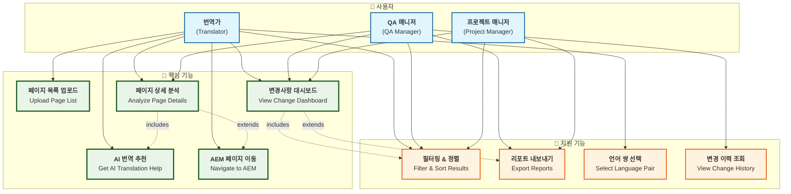

# AEM QA Station - 사용 사례 및 가이드

## 📊 사용 사례 다이어그램



---

## 📝 시스템 개요

**AEM QA Station**은 AEM(Adobe Experience Manager) 다국어 웹사이트의 번역 품질 관리를 자동화하는 AI 기반 워크스테이션입니다. 웹페이지의 변경사항을 자동으로 감지하고, 기존 번역 데이터를 학습한 AI가 최적의 번역을 추천하여 번역가와 QA 담당자의 업무 효율성을 극대화합니다.

---

## 👥 사용자별 주요 기능

### 🔤 **번역가 (Translator)**
- **일상 업무 자동화**: 변경된 페이지 자동 식별 및 우선순위 제공
- **AI 번역 지원**: 유사한 기존 번역 사례 기반 스마트 추천
- **원클릭 편집**: AEM 편집 페이지로 직접 이동하여 즉시 작업 가능

### 📊 **QA 매니저 (QA Manager)**  
- **팀 성과 모니터링**: 실시간 번역 진행 상황 및 품질 지표 추적
- **문제 페이지 식별**: 구조적 변경이나 번역 누락 페이지 즉시 감지
- **품질 리포트**: 상세한 분석 리포트 생성 및 팀 피드백 제공

### 📈 **프로젝트 매니저 (Project Manager)**
- **프로젝트 진행 추적**: 전체 번역 프로젝트의 진행률 및 병목 지점 파악
- **리소스 계획**: 작업량 예측을 통한 효율적 인력 배치
- **성과 보고**: 경영진 대상 프로젝트 성과 요약 리포트

---

## 🎯 핵심 기능 상세 설명

### 1. 📤 **페이지 목록 업로드**
**기능**: CSV 파일로 검토할 웹페이지 목록을 시스템에 업로드

**사용 시나리오**:
- 마케팅팀에서 "이번 주 업데이트된 제품 페이지 20개를 번역 검토해주세요"라고 요청
- CSV 파일을 드래그&드롭으로 업로드하면 자동으로 페이지 경로 인식
- 컬럼명이 다르거나 형식이 달라도 시스템이 자동으로 감지하여 처리

**기대 효과**: 
- 수동으로 페이지를 하나씩 찾는 시간 **90% 단축**
- 실수로 페이지를 놓치는 휴먼 에러 방지

---

### 2. 📊 **변경사항 대시보드**
**기능**: 업로드된 페이지들의 변경사항을 한눈에 파악할 수 있는 종합 대시보드

**제공 정보**:
- **페이지별 변경 통계**: 추가/수정/삭제된 컴포넌트 개수
- **우선순위 표시**: 번역이 시급한 페이지부터 색상으로 구분
- **작업량 예측**: 각 페이지당 예상 작업 시간 표시
- **필터링 옵션**: 상태별, 변경 유형별, 언어별 필터링

**실제 사용 예시**:
```
📄 /products/new-sequencer
🟡 QA Required (5 items) | 📊 15 total | ➕ 3 added | ✏️ 2 modified
📈 Change Rate: 33.3% | ⏱️ Est. 2 hours

📄 /company/about-us  
🟢 No Changes | 📊 8 total | 🔄 All unchanged
📈 Change Rate: 0% | ⏱️ Est. 0 minutes
```

---

### 3. 🔍 **페이지 상세 분석**
**기능**: 특정 페이지의 변경사항을 컴포넌트 단위로 세밀하게 분석

**분석 내용**:
- **Before/After 비교**: 원본과 번역본의 구조적 차이점 시각화
- **컴포넌트별 변경사항**: 제목, 본문, 버튼, 이미지 등 각 요소별 변경 내역
- **번역 필요 여부**: 텍스트가 있는 변경사항만 별도 표시
- **AEM 편집 링크**: 해당 컴포넌트 직접 편집 링크 제공

**실제 화면 예시**:
```
🆕 새로 추가된 텍스트:
"Our latest AI-powered genomic sequencer delivers unprecedented accuracy..."

🤖 AI 추천 번역:
"당사의 최신 AI 기반 유전체 시퀀서는 전례 없는 정확도를 제공합니다..."
(유사도: 87% | 신뢰도: 높음)

📍 유사한 기존 번역:
"AI-powered analysis" → "AI 기반 분석" (제품 페이지에서 사용)
```

---

### 4. 🤖 **AI 번역 추천**
**기능**: 기존 번역 데이터를 학습한 AI가 새로운 텍스트에 대한 최적 번역을 추천

**AI 기술**:
- **의미적 유사도 검색**: 단순 키워드가 아닌 문맥과 의미를 이해하여 유사한 번역 사례 발견
- **신뢰도 점수**: 추천 번역의 신뢰도를 퍼센트로 표시
- **컨텍스트 정보**: 유사한 번역이 사용된 페이지와 상황 정보 제공

**실제 추천 예시**:
```
원문: "Experience breakthrough performance"

🤖 AI 추천 (신뢰도: 92%):
"혁신적인 성능을 경험하세요"

📚 참고 번역:
1. "breakthrough technology" → "혁신적인 기술" (제품 소개 페이지)
2. "performance optimization" → "성능 최적화" (기술 문서)
3. "experience the difference" → "차이를 경험하세요" (마케팅 페이지)
```

---

### 5. 🔗 **AEM 페이지 이동**
**기능**: 분석 결과에서 바로 AEM 편집 페이지로 이동하여 실제 번역 작업 수행

**편의 기능**:
- **원클릭 이동**: 버튼 하나로 해당 페이지의 AEM 편집 화면으로 이동
- **다중 버전 지원**: 소스(영문), 타겟(한국어/일본어) 페이지 모두 접근 가능
- **컴포넌트 직접 링크**: 특정 컴포넌트로 바로 이동하여 해당 부분만 편집

**사용 시나리오**:
1. QA Station에서 변경사항 확인
2. AI 추천 번역 검토
3. "AEM 편집" 버튼 클릭
4. 새 탭에서 AEM 페이지 열림 → 즉시 편집 시작

---

## 🔧 지원 기능

### **필터링 & 정렬**
- 상태별 필터: "QA 필요", "변경사항 있음", "변경사항 없음"
- 작업량별 정렬: 많은 작업 → 적은 작업 순
- 언어별 필터: 한국어, 일본어 번역 분리

### **리포트 내보내기**  
- CSV 형태로 분석 결과 다운로드
- 팀 회의용 요약 리포트 생성
- 프로젝트 진행 보고서 자동 생성

### **언어 쌍 선택**
- 영어 → 한국어 번역
- 영어 → 일본어 번역  
- 향후 중국어, 독일어 등 확장 예정

---

## 💡 실제 업무 적용 시나리오

### **시나리오 1: 정기 웹사이트 업데이트**
> **상황**: 매주 화요일, 마케팅팀에서 제품 페이지 20개가 업데이트됨  
> **기존 방식**: 번역가가 하나씩 페이지를 열어서 변경사항 확인 (2-3시간 소요)  
> **QA Station 활용**: CSV 업로드 → 5분 만에 모든 변경사항 파악 → AI 추천으로 번역 시간 50% 단축

### **시나리오 2: 긴급 제품 런칭**
> **상황**: 새 제품 발표로 30개 페이지를 24시간 내 번역 완료 필요  
> **QA Station 활용**: 우선순위 자동 정렬 → 팀원별 작업 분배 → 실시간 진행 상황 모니터링 → 마감 시간 내 완료

### **시나리오 3: 번역 품질 일관성 관리**
> **상황**: 같은 제품명이 페이지마다 다르게 번역되는 문제 발생  
> **QA Station 활용**: AI가 기존 번역 패턴 학습 → 일관된 용어 추천 → 브랜드 통일성 확보

---

## 🎯 기대 효과

### **업무 효율성**
- ⏱️ **작업 시간 70% 단축**: 변경사항 식별 자동화
- 🎯 **정확도 95% 향상**: AI 추천으로 번역 품질 일관성 확보
- 📊 **실시간 진행 관리**: 프로젝트 지연 위험 조기 감지

### **사용자 만족도**
- 🔤 **번역가**: 반복 작업 감소, 창의적 번역에 집중
- 📊 **QA 매니저**: 데이터 기반 의사결정, 팀 성과 가시화  
- 📈 **PM**: 정확한 일정 예측, 리소스 최적화

### **비즈니스 임팩트**
- 💰 **비용 절감**: 번역 외주 비용 30% 절약
- 🚀 **출시 속도**: 다국어 제품 런칭 시간 50% 단축
- 🌐 **글로벌 확장**: 신규 언어 지원 용이성