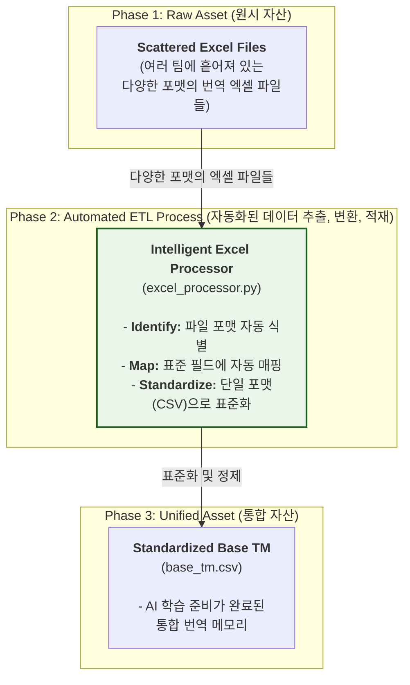
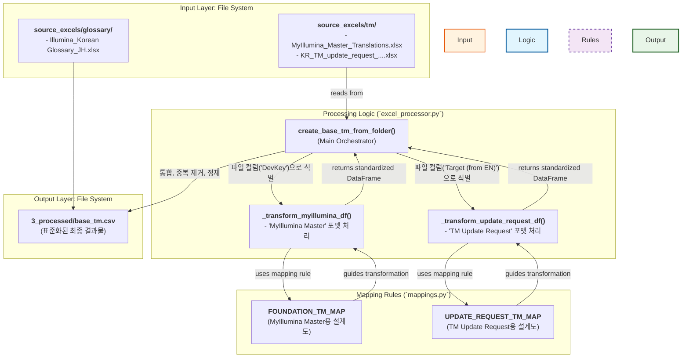

네, 알겠습니다. 최우선 과제에 집중하죠. 앞으로의 모든 기능 확장을 위한 가장 튼튼한 기반을 다지는 작업이 될 것입니다.

사용자님께서 말씀하신 대로, 기존 사내 번역 메모리(TM)를 우리 시스템에 통합하는 전체 흐름을 완벽하게 파악할 수 있도록 \*\*High-level (비즈니스 관점)\*\*과 \*\*Low-level (기술 관점)\*\*의 다이어그램을 그리고, 관련 핵심 부품들의 역할을 명확하게 정리해 드리겠습니다.

-----

### **1. High-Level 다이어그램: 비즈니스 가치 흐름**

이 다이어그램은 \*\*"우리는 어떻게 흩어져 있는 사내 엑셀 번역 자산을 표준화된 AI 학습 데이터로 전환하는가?"\*\*라는 비즈니스 질문에 답합니다.

-----

### **2. Low-Level 다이어그램: 기술 실행 흐름**

이 다이어그램은 개발팀이 \*\*"어떤 코드가, 어떤 데이터를 가지고, 어떤 순서로 이 프로세스를 실행하는가?"\*\*를 정확히 이해하기 위한 기술 설계도입니다.

-----

### **3. 핵심 부품 및 플로우 정리**

이 전체 프로세스는 **`notebooks/1_process_linguist_assets.ipynb`** 노트북에서 시작되고 오케스트레이션됩니다. 이 노트북이 실행되면 다음과 같은 일이 벌어집니다.

1.  **시작점 (`create_base_tm_from_folder` 호출):**

      * `1_process_linguist_assets.ipynb`에서 **`excel_processor.py`** 안에 있는 `create_base_tm_from_folder` 함수를 호출하며, `source_excels/tm` 폴더를 처리하도록 지시합니다.

2.  **지능적 파일 식별:**

      * `create_base_tm_from_folder` 함수는 `source_excels/tm` 폴더 안의 모든 `.xlsx` 파일을 순회합니다.
      * 각 파일을 Pandas로 읽은 후, **파일의 컬럼 이름을 보고 어떤 종류의 파일인지 스스로 식별**합니다.
          * 만약 `'DevKey'` 컬럼이 존재하면, 이 파일은 'MyIllumina Master' 포맷이라고 판단하고 `_transform_myillumina_df` 헬퍼 함수를 호출합니다.
          * 만약 `'Target (from EN)'` 컬럼이 존재하면, 이 파일은 'TM Update Request' 포맷이라고 판단하고 `_transform_update_request_df` 헬퍼 함수를 호출합니다.

3.  **정해진 규칙에 따른 변환:**

      * 각각의 헬퍼 함수(`_transform_...`)는 \*\*`mappings.py`\*\*에 정의된 자신만의 '설계도(MAP)'를 사용합니다.
      * 예를 들어, `_transform_myillumina_df`는 `FOUNDATION_TM_MAP`을 사용하여, 'English' 컬럼은 `source_text`로, 'Korean' 컬럼은 `target_text`로 이름을 바꾸는 등 표준화된 포맷으로 데이터를 변환합니다.

4.  **통합 및 최종 결과물 생성:**

      * `create_base_tm_from_folder` 함수는 각 헬퍼 함수로부터 반환된 표준화된 데이터들을 하나로 합칩니다.
      * 그 후, 중복된 번역 쌍을 제거하고(`source_text` 기준), 비어있는 값을 정리하는 등 최종적인 데이터 정제 작업을 수행합니다.
      * 마지막으로, 이 모든 정제된 데이터를 **`data/3_processed/base_tm.csv`** 라는 단일 파일로 저장하며 프로세스를 마칩니다.

이제 이 '지도'를 가지고, 우리는 자신 있게 다음 기능 개선 단계로 나아갈 수 있습니다.